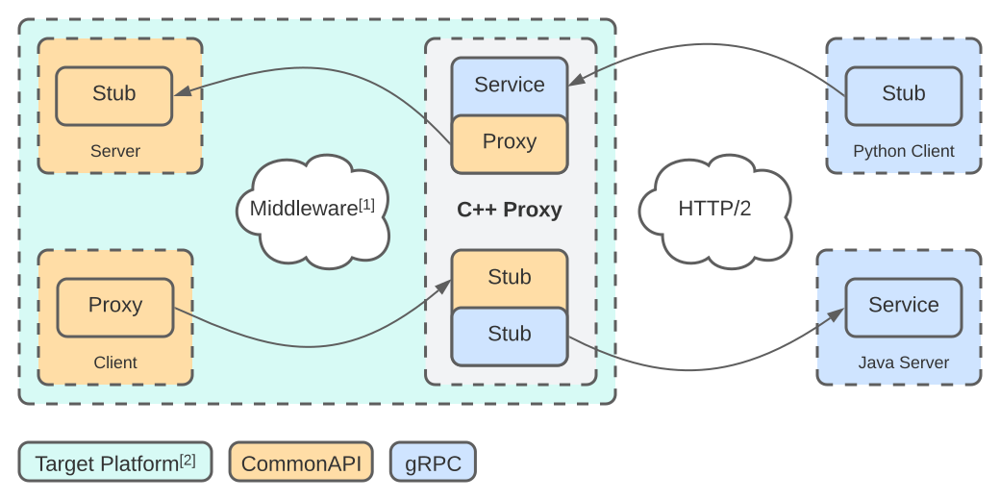

For now this repository contains a concept paper that describes the need for an IDL-to-IDL mapping between Franca IDL and Protocol Buffers IDL and a possible architecture of an automatically generated proxy that combines gRPC and CommonAPI. The goal is to expose the CommonAPI, which is based on Franca IDL, by a fully compatible gRPC interface in order to make it accessible to clients written in other languages.

# Terms And Abbreviations

* IPC - Inter-Process Communication
* RPC - Remote Procedure Call. This term might be used interchangeably with IPC.
* IDL - Interface Definition Language.
* Franca IDL - An IDL developed by COVESA.
* CommonAPI - C++ IPC framework which uses a code generator that accepts Franca IDL as input and produces a user friendly C++ API.
* gRPC - Stands for 'gRPC Remote Procedure Calls' and is an HTTP/2 based RPC framework.
* Protocol Buffers - Language for serializing structured data, but which can also be used as an IDL by defining services. It is programming language and platform independent.

# Motivation

One widespread IPC framework in the automotive industry is CommonAPI which provides a middleware independent C++ API and making it easily possible to implement classic client-server applications. The framework uses Franca IDL for defining the interface and a code generator for producing a user friendly C++ API. However this means clients or servers are forced to be implemented in C++. However in complex development environments it is sometimes necessary to use other programming languages depending on the underlying domain, e.g. it could be possible to implement a client for test purposes in Python that connects to a server written in C++. Additional to that both applications might run on different platforms.

* The API can be developed and tested with the help of tools like [Postman](https://www.postman.com/) that natively support gRPC APIs
* Clients can be implemented in different languages and in an idiomatic way.

# Language Mapping

The following table shall give a concise overview of the mapping between Franca IDL interface elements and the protocol buffers service counterpart. An interface definition in Franca IDL refers to a service definition in protocol buffer. Because Franca IDL provides more features than gRPC it is not possible to have a one-to-one mapping for all of them. Therefore it is required to compose higher level concepts out of native gRPC functionality. Both IDLs don't claim any specific call semantics. This means it depends on the concrete IPC framework whether it supports a synchronous and/or an asynchronous programming model. However gRPC supports both.

The language mappings for types can be found [here](docs/TypeMappings.md)

| Franca Interface Element | Protobuf Service Element |
| --- | --- |
| Method | Unary RPC from client to server. This concept is a one-to-one mapping and has exactly the same semantics in gRPC. Instead of having in-parameters and out-parameters explicitly listed, a Unary RPC will encode parameters as a simple message type where each field corresponds to one parameter. Therefore in-parameters are mapped to the request and out-parameters are mapped to the response.  |
| Broadcast | Subscribing and unsubscribing for broadcasts is done through the usage of a Unary RPC from client to server. Subscribing returns a unique identifier, the token, which can then be used to unsubscribe for messages. Because gRPC doesn't support broadcasts out of the box, a server-streaming RPC will be used for pushing messages from the server to the client. In order to be able to identify the server-streaming RPC the request must contain the token. If the client unsubscribes with the token the server-streaming RPC is done.
| Attribute | For setting and getting the value a Unary RPC from client to server is used. Change events will be propagated like normal broadcasts. |

# Proxy Architecture

The following diagram uses the nomenclature that is usual for the respective framework. Unfortunately CommonAPI and gRPC are using the term `Stub` for the exact opposite communication part. The equivalent to a gRPC `Stub` is the CommonAPI `Proxy`.

[1] This can be for example SOME/IP, D-Bus or a custom IPC binding.

# Roadmap

- [ ] Define a mapping between Franca IDL and Protocol Buffers IDL
- [ ] Take CommonAPI types into account and compare it with the generated C++ Protocol Buffers code
